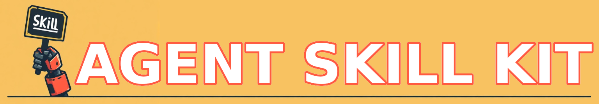

# Agent Skill Kit

<p align="center">
    
</p>

A toolkit of reusable agentic skills for AI agent development.

[](LICENSE)
[](https://claude.ai)
[](https://cursor.sh)
[](https://github.com/cline/cline)
[](https://github.com/google-gemini/gemini-cli)
[]([https://continue.dev](https://github.com/continuedev/continue))
[](https://openchamber.dev/)
[](https://github.com/features/copilot)

## Installation

### Full library install

```bash
npx skills@latest add tejasashinde/agent-skill-kit
# OR
# npx skills add https://github.com/tejasashinde/agent-skill-kit
```

### Specific skill from library
```bash
npx skills@latest add tejasashinde/agent-skill-kit/<skill-name>
# Eg. npx skills@latest add tejasashinde/agent-skill-kit/five-minute-summary

# OR
# npx skills add https://github.com/tejasashinde/agent-skill-kit --skill five-minute-summary
```

## Skill Catelog

See [CATALOG.md](CATALOG.md) for the full catalog with description

## Useful Resources

- **[Claude Skills Docs](https://code.claude.com/docs/en/skills)**: Claude documentation for creating and using Skills to extend model capabilities with reusable, task-specific behaviors.
- **[Anthropic Skills Guide](https://resources.anthropic.com/hubfs/The-Complete-Guide-to-Building-Skill-for-Claude.pdf)**: Official Anthropic PDF guide explaining how to design, build, test, and structure Claude Skills as reusable workflow modules for automating and standardizing tasks.
- **[OpenAI Developer Tools Skills Guide](https://developers.openai.com/api/docs/guides/tools-skills)**: Official OpenAI documentation explaining how tools and skills work in the API ecosystem, including how to extend model capabilities using structured, reusable tool-based workflows.
- **[Agent Skills Quickstart](https://agentskills.io/skill-creation/quickstart)**: Official guide introducing how to create an Agent Skill using the `SKILL.md` format, including folder structure, metadata fields, and how agents discover and execute skills through progressive disclosure in compatible AI coding environments.
- **[Microsoft Agent Framework – Skills](https://learn.microsoft.com/en-us/agent-framework/agents/skills?pivots=programming-language-python)**: Official Microsoft documentation describing how agent skills extend AI agents with reusable capabilities, including tool-based workflows, modular skill definitions, and integration patterns for Python-based agent systems.
- **[DigitalOcean Community – How to Implement Agent Skills](https://www.digitalocean.com/community/tutorials/how-to-implement-agent-skills)**: Tutorial explaining how agent skills are structured as modular folders containing `SKILL.md` files, scripts, and resources, and how agents discover and execute these skills as reusable capability units in LLM-based systems.
- **[Android Developer – Agent Skills](https://developer.android.com/tools/agents/android-skills)**: Official Android documentation describing how agent skills are integrated into Android agent tooling to extend LLM-powered assistants with reusable task modules and structured skill definitions for mobile and system automation.
- **[LM-Kit – Agent Skills Explained](https://lm-kit.com/blog/agent-skills-explained)**: Overview of agent skills as reusable components for LLM agents, describing how skills package instructions, tools, and context into modular units that extend agent capabilities.
- **[Spillwave – Mastering Agentic Skills: The Complete Guide to Building Effective Agent Skills (Medium)](https://pub.spillwave.com/mastering-agentic-skills-the-complete-guide-to-building-effective-agent-skills-d3fe57a058f1)**: Conceptual guide explaining how agentic skills are designed as modular capability units that improve agent reliability, composability, and reuse across multi-step AI workflows.
- **[Deep Dive: Skill.md Part 1 – abvijaykumar (Medium)](https://abvijaykumar.medium.com/deep-dive-skill-md-part-1-2-09fc9a536996)**: Technical explanation of the `SKILL.md` format, covering its structure, metadata design, and role in helping agents interpret and execute skills based on user intent.
- **[Getting Deep Agents to Work with Skill.md Part 2 – abvijaykumar (Medium)](https://abvijaykumar.medium.com/getting-deep-agents-to-work-with-skill-md-part-2-2-a65707eb5131)**: Continuation of the Skill.md deep dive, focusing on runtime skill discovery, chaining, and how agents dynamically select and orchestrate skills for autonomous task execution.

## Inspirations

This project was inspired by the following repositories:

- **[sickn33/antigravity-awesome-skills](https://github.com/sickn33/antigravity-awesome-skills)**
- **[ComposioHQ/awesome-claude-skills](https://github.com/ComposioHQ/awesome-claude-skills)**

## Support the Project

- Star the repository if you found it useful
- Contribute your skills and fixes.

## License

- MIT License. See [LICENSE](LICENSE) for the detailed license.

---
